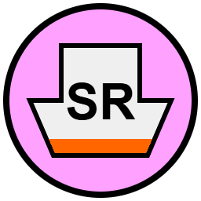

# Public Safety Vessels TAK Iconset

This repository contains a custom TAK iconset for public safety vessels used in New Zealand emergency management operations.

## Icons Included

| Icon | Filename | Description |
|------|----------|-------------|
|  | CustomsVessel.png | New Zealand Customs Service vessels |
|  | FireVessel.png | Fire and Emergency New Zealand marine units |
|  | PilotVessel.png | Maritime pilot vessels |
|  | PoliceVessel.png | New Zealand Police marine units |
|  | SARVessel.png | Search and Rescue vessels |

## Building the Package

To create the TAK data package:

```bash
./scripts/create_TAKDataPackage.sh
```

This will generate `PublicSafetyVessels-Package.zip` which can be imported into TAK.

## Installation

1. Download the latest release package
2. Import the `.zip` file into your TAK application
3. The vessel icons will be available in the iconset selection

## Usage in TAK

Once installed, reference these icons using the format: `{iconset-uid}/{filename}`

Examples:
- `f8c9d2a1-4b5e-4c7f-9a8b-1d2e3f4g5h6i/CustomsVessel.png`
- `f8c9d2a1-4b5e-4c7f-9a8b-1d2e3f4g5h6i/FireVessel.png`
- `f8c9d2a1-4b5e-4c7f-9a8b-1d2e3f4g5h6i/PilotVessel.png`
- `f8c9d2a1-4b5e-4c7f-9a8b-1d2e3f4g5h6i/PoliceVessel.png`
- `f8c9d2a1-4b5e-4c7f-9a8b-1d2e3f4g5h6i/SARVessel.png`

## Structure

- `source/` - Contains the iconset.xml and vessel images
- `datapackage/` - TAK mission package structure
- `scripts/` - Build automation scripts