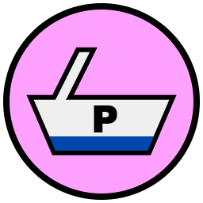
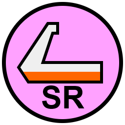
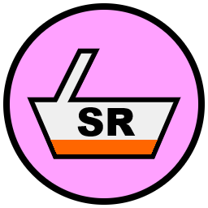
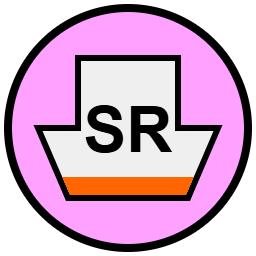

# Public Safety Vessels TAK Iconset

This repository contains a custom TAK iconset for public safety vessels used in New Zealand emergency management operations.

## Icons Included

| Icon | Filename | Type 2525B | Description |
|------|----------|------------|-------------|
|  | CustomsJetsky.png | a-f-S-X-L | New Zealand Customs Service jetsky |
|  | CustomsSpeedBoat.png | a-f-S-X-L | New Zealand Customs Service speed boat |
|  | CustomsVessel.png | a-f-S-X-L | New Zealand Customs Service vessel |
|  | FireJetsky.png | a-f-S-X | Fire and Emergency New Zealand jetsky |
|  | FireSpeedBoat.png | a-f-S-X | Fire and Emergency New Zealand speed boat |
|  | FireVessel.png | a-f-S-X | Fire and Emergency New Zealand vessel |
|  | PilotVessel.png | a-f-S-N-S | Maritime pilot vessel |
|  | PoliceJetsky.png | a-f-S-X-L | New Zealand Police jetsky |
|  | PoliceSpeedBoat.png | a-f-S-X-L | New Zealand Police speed boat |
|  | PoliceVessel.png | a-f-S-X-L | New Zealand Police vessel |
|  | SARJetsky.png | a-f-S-N-N-R | Search and Rescue jetsky |
|  | SARSpeedBoat.png | a-f-S-N-N-R | Search and Rescue speed boat |
|  | SARVessel.png | a-f-S-N-N-R | Search and Rescue vessel |

## Building the Package

To create the TAK data package:

```bash
./scripts/create_TAKDataPackage.sh
```

This will generate `PublicSafetyVessels-Package.zip` which can be imported into TAK.

## Installation

1. Download the latest release package
2. Import the `.zip` file into your TAK application
3. The vessel icons will be available in the iconset selection

## Usage in TAK

Once installed, reference these icons using the format: `{iconset-uid}/{filename}`

Examples:
- `f8c9d2a1-4b5e-4c7f-9a8b-1d2e3f4g5h6i:Vessels/CustomsJetsky.png`
- `f8c9d2a1-4b5e-4c7f-9a8b-1d2e3f4g5h6i:Vessels/CustomsSpeedBoat.png`
- `f8c9d2a1-4b5e-4c7f-9a8b-1d2e3f4g5h6i:Vessels/CustomsVessel.png`
- `f8c9d2a1-4b5e-4c7f-9a8b-1d2e3f4g5h6i:Vessels/FireJetsky.png`
- `f8c9d2a1-4b5e-4c7f-9a8b-1d2e3f4g5h6i:Vessels/FireSpeedBoat.png`
- `f8c9d2a1-4b5e-4c7f-9a8b-1d2e3f4g5h6i:Vessels/FireVessel.png`
- `f8c9d2a1-4b5e-4c7f-9a8b-1d2e3f4g5h6i:Vessels/PilotVessel.png`
- `f8c9d2a1-4b5e-4c7f-9a8b-1d2e3f4g5h6i:Vessels/PoliceJetsky.png`
- `f8c9d2a1-4b5e-4c7f-9a8b-1d2e3f4g5h6i:Vessels/PoliceSpeedBoat.png`
- `f8c9d2a1-4b5e-4c7f-9a8b-1d2e3f4g5h6i:Vessels/PoliceVessel.png`
- `f8c9d2a1-4b5e-4c7f-9a8b-1d2e3f4g5h6i:Vessels/SARJetsky.png`
- `f8c9d2a1-4b5e-4c7f-9a8b-1d2e3f4g5h6i:Vessels/SARSpeedBoat.png`
- `f8c9d2a1-4b5e-4c7f-9a8b-1d2e3f4g5h6i:Vessels/SARVessel.png`

## Structure

- `source/` - Contains the iconset.xml and vessel images
- `datapackage/` - TAK mission package structure
- `scripts/` - Build automation scripts